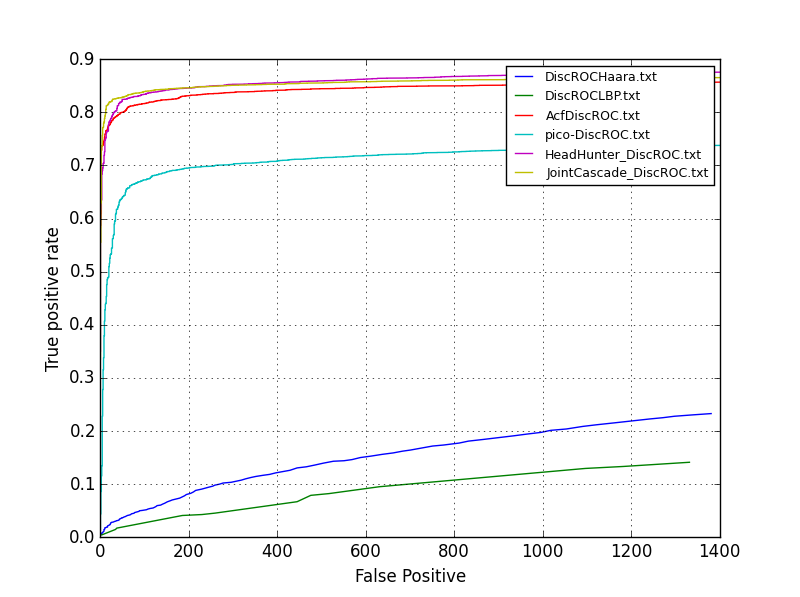
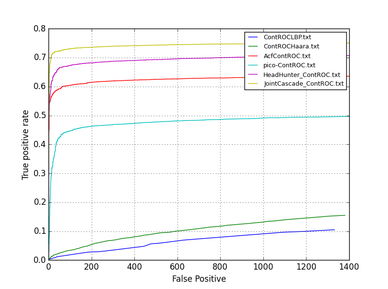

# ITLab Vision — Biweekly Report — 24 November 2014

----------------

## Результаты
 
  1. Работа с библиотеками глубинного обучения:
     - Обучены [различные][dnn] [модели][dnn-repo] для задачи классификации
       рукописных цифр (база MNIST) с помощью четырех библиотек Pylearn2, Caffe,
       Torch, Teano.
     - Результаты сравнения библиотек занесены в [таблицу][dnn-results].
     - Результаты сравнения качества классификации цифр на базе MNIST, а также времена
       обучения моделей занесены в [таблицу][dnn-results]. Сравнение по времени качественное
       из-за отсутствия единой тестовой инфраструктуры.
     - Подготовлен план статьи по библиотеками глубинного обучения. Рабочий документ 
       по [ссылке][paper].
     - Разработна обертка на C++ с целью использования глубоких сетей, обученных с помощью 
       перечисленных библиотек, для решения задач классификации и детектирования (реализован 
       метод скользящего окна с поддержкой масштабирования изображения).
     - Протестирована обертка для классификатора и детектора цифр - сети Lenet, обученной 
       с помощью Torch.

  1. Изучение алгоритмов детектирования пешеходов, автомобилей, лиц:
     - Построены ROC-кривые для 4 лучших алгоритмов детектирования лиц, опубликованных 
       на [сайте FDDB][FDDB-page]. Также на графиках показаны ROC-кривые качества работы 
       каскадного детектора лиц с LBP-признаками (модель `lbpcascade_frontalface.xml`),
       и с признаками Хаара (модель `haarcascade_frontalface_alt.xml`).

\
__Fig 1.1 LBP discrete ROC-curves on FDDB.__

\
__Fig 1.2 LBP continuous ROC-curves on FDDB.__

     - Те же ROC-кривые перестроены в системе координат [False Positives per Frame, True Positive Rate].

.png "discrete ROC-curves")\
__Fig 1.3 LBP discrete ROC-curves on FDDB.__

.png "continuous ROC-curves")\
__Fig 1.4 LBP continuous ROC-curves on FDDB.__ 

     - Собраны 3 датасета с изображениями лиц (Caltech ~ 7100 изображений, 
       [CMU](http://vasc.ri.cmu.edu/idb/html/face) ~ 180 , [FEI](http://fei.edu.br/~cet/facedatabase.html) - 400).
       Их планируется использовать для обучения классификаторов.
     - Обучен ICF Detector на множестве изображений INRIA-train_64x128_H96. 
       [Полученный классификатор][ICF-classifier].
     - Частично сформирована инфраструктура для оценки качества работы ICF детектора.

## Планы

  1. Работа с библиотеками глубинного обучения:
     - Выбрать максимально похожие конфигурации сетей и параметры алгоритмов
       обучения для непосредственного сравнения качества и скорости работы
       различных библиотек при решении задачи классификации лиц.
     - Повторно провести эксперименты с целью измерения времени обучения глубоких сетей и обеспечения 
       корректного сравнения скорости работы библиотек.
     - Выбрать топологии сетей и алгоритмы обучения, зарекомендовавшие себя для решения задачи 
       детектирования лиц.
     - Написать статью, содержащую сравнение библиотек глубинного обучения.
     - Подготовиться к проведению семинара (ориентировочная дата - 26.12.2014).

  1. Изучение алгоритмов детектирования пешеходов, автомобилей, лиц:
     - Провести эксперименты для подбора параметров LBP- и Haar-классификаторов.
     - Подбор оптимальной тренировочной базы изображений для построения моделей LBP- и Haar-классификаторов.
     - Провести полномасштабный эксперимент (обучение и тестирование) по оценке
       качества ICF-детектора для детектирования пешеходов (автомобилей).

<!-- LINKS -->

[dnn-results]: https://docs.google.com/spreadsheets/d/1U5v-xap-dkm5Hu-uh49nn7NEwNafjEE9Bos9qsz0wo0/edit?usp=sharing
[dnn]: https://drive.google.com/open?id=0B1Xio1gViu12c0czOUFJNVoxWUU&authuser=0
[dnn-repo]: https://github.com/KruchDmitriy/DNN-develop
[peds-dataset]: http://www.vision.caltech.edu/Image_Datasets/CaltechPedestrians/datasets/
[icf-code]: https://github.com/VladVin/obj-detect-classifiers/tree/master/src/icfdetector
[FDDB-page]: http://vis-www.cs.umass.edu/fddb/results.html
[paper]: https://drive.google.com/folderview?id=0B1Xio1gViu12c0czOUFJNVoxWUU&usp=drive_web#list
[ICF-classifier]: https://github.com/ITLab-Vision/obj-detect-classifiers/blob/master/trained-classifiers/icfdetector/64x128_H96_model.xml